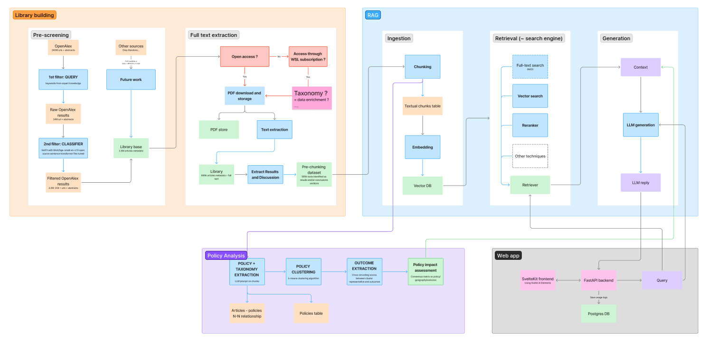

# Democratiser la sobriété

Un projet visant à démocratiser les approches de sobriété grâce à un système RAG (Retrieval-Augmented Generation) et des outils d'analyse automatisée.

> [!IMPORTANT]
> Il est interdit de pusher de la documentation générée par IA. De même, pour les issues et la description des PR. En faisant cela, vous gagnez du temps mais en faites perdre aux autres. De même, soyez prudent avec le code généré par IA car, outre sa fiabilité qu'il faut vérifier, il est excessivement verbeux. Le code et la doc sont aussi bien des actifs que des passifs donc il faut viser une certaine efficience : assez mais pas trop.


## Présentation du projet

Le projet est structuré en plusieurs sous-projets :

- **Visualisation** (branche `visualizations-combined` non encore mergée) :
    - [Carbon budget](https://app-d066b92e-20ba-4dbf-af25-73c7e5657091.cleverapps.io/) : budget carbone restant par pays pour rester sour les 2°C de réchauffement
    - Décomposition [monde](https://app-e1c3f118-5441-449a-99f3-fa4036bb2ad4.cleverapps.io/) et [UE](https://app-ac31ad44-d32f-4998-87c6-b9b699c29c63.cleverapps.io/) de scénarios de décarbonation en Population - Décarbonation - Efficacité énergétique - Sobriété
    - [Indicateurs de bien-être](https://app-aa62786e-21f6-42ab-b0ff-ddca6575e4f8.cleverapps.io/) (EWBI)
- **Library** : base d'articles sur la sobriété dans `src`.
- **Policy analysis** (dans `rag_system/policy_analysis`) : pipeline d'extraction et d'analyse de politiques de sobriété et de leurs impacts dont les résultats ont vocation à être inclus dans le RAG.
- **ChatSufficiency** (dans `rag_system`) : chatbot destiné aux experts des politiques publiques, branchés en RAG sur la library et les résultats de la policy analysis.

Le projet se fonde également sur une **taxonomie** développée en amont, avec l'objectif d'enrichir les articles de la library de métadonnées "métier" (en plus des métadonnées issues d'OpenAlex) via un traitement par LLM. Celle-ci est présente en double dans le code, dans `rag_system/taxonomy` et `src/wsl_library_domain`.

Un refactoring est prévu pour éliminer ce doublon, mieux séparer les sous-projet et remplacer la librairie de RAG Kotaemon par du code custom.

Voici un schéma d'architecture du projet (à mettre à jour) :



## Library

La library est constituée en trois grandes étapes :
1. Pré-screening : récupération des références des articles traitant de la sobriété sur OpenAlex
2. Extraction full-text : récupération des textes complets pour autant d'articles que possible
3. Extraction de la taxonomie : les métadonnées des articles sont enrichis par une taxonomie extraite des articles par traitement NLP.

[README Library](src/wsl_library/README.md)


## Policy analysis
Deux étapes dévelopées dans ce sous projet: 
- Extraction des données des abstract puis des full text ( pas testé ?) pour strucutrer les metadonnées des policies 
    - Le full text va récuperer les données des pollitiques basé sur l'id open alex sur la base Qdrant
- Pipeline d'analyse des secteurs des pollitiques et de leur facteurs puis clustering des pollitiques avec des test avec Knn, Kmeans et HDbscan
    - Plusieur scripts d'optimisations ont été fait 

Les fichiers sont sauvegardés en csv et il faudra intégrer les résultats pour etre disponibles pour le chat sufficiency 
Le projet semble avoir été un repo à part ajouté au monorepo et il semble y avoir des incohérences dans les dépendences 

[README Policy Analysis](rag_system/policy_analysis/README.md)


## ChatSufficiency
Il s'agit de brancher un un système de Retrieval Augmented Generation (RAG) sur la library, soit un chatbot composé de deux sous-systèmes :
- un retriever ~ moteur de recherche sur la library ;
- un LLM répondant à la requête à partir des documents retournés par le retriever.

Le travail initial s'est fondé sur la librairie open source Kotaemon, qui s'est avérée amener plus de complications qu'elle n'en évitait.
Il a donc été décidé d'en sortir et de réimplémenter les fonctionnalités nécessaires avec du code custom.

[README ChatSufficiency](rag_system/README.md)

## Ressources cloud


## Roadmap

Voici dans les grosses mailles les étapes prévues:

- [ ] Nettoyage du repo et de la base de données postgres
- [ ] Refactoring pour mieux isoler les sous-projets
- [ ] Web app moteur de recherche par mot-clés sur les abstracts des articles de la library
- [ ] Refaire tourner l'extraction du full-text pour les articles open access et essayer de l'obtenir par les abonnements du WSL pour les autres
- [ ] Adaptation du moteur de recherche au full text
- [ ] Chunking et embedding pour ingestion en base vectorielle
- [ ] Adaptation du moteur de recherche à la recherche sémantique
- [ ] V1 du chatbot : génération par LLM + adaptation de la web app
- [ ] Finalisation du pipeline de policy analysis
- [ ] Intégration de la policy analysis au chatbot
- [ ] V2 du chatbot


## 🚀 Quick Start

### 1. Installer les dépendances `uv` et `pip`

```bash
# macOS et Linux
curl -LsSf https://astral.sh/uv/install.sh | sh

# Windows
powershell -c "irm https://astral.sh/uv/install.ps1 | iex"

# Alternative : via pip
pip install uv
```

Plus d'informations : [documentation officielle de uv](https://astral.sh/uv)


### 2. Lancer les precommit-hooks localement

[Installer les precommit](https://pre-commit.com/)

    pre-commit run --all-files

### 3. Utiliser Tox pour tester votre code

    tox -vv


> [!IMPORTANT]
> Projet en développement actif, pas de garantie de fonctionnement, notamment pour les tests.
