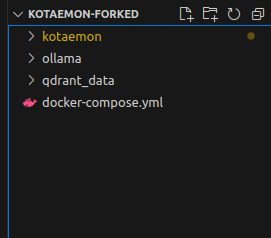

[FR]
# Guide d'installation pour Kotaemon / Ollama (en local)

## 1) Installation + simple : avec le docker-compose

*** Intérêt du docker compose : le docker compose paralyse le lancement de l'app Kotaemon... qui sera lancée "à la main".

Cela peut faliciter la tâche pour faire du développement en mode test de l'app globale ***

Ollama va être le service d'hébergement / inférence des modèles de llm hébergés en local.

Si vous souhaitez utiliser le GPU de votre ordinateur, suivez scrupuleusement la doc officielle ici en lien : https://hub.docker.com/r/ollama/ollama

[sans lancer le container à la fin ... car cela sera fait avec le docker compose]

Créer votre dossier de travail.

Faite un <code> git clone https://github.com/Cinnamon/kotaemon.git</code>

afin de cloner le repo git officiel de Kotaemon

(par la suite, on clonera plutôt notre propre version du projet forké)
 
Placer le fichier docker-compose donné en example (dans ce même dossier) à la racine de votre projet.

Attention , pas dans le dossier "kotaemon" qui a été créé avec le git clone, mais plutôt "à côté" dans votre dossier de travail...

Depuis votre dossier de travail,
faite simplement <code> docker compose up </code>

## 1 alt.) Installation alternative (dissociées) avec docker

#### a) Lancer le service Ollama

Ollama va être le service d'hébergement / inférence des modèles de llm hébergés en local.

Suivre scrupuleusement la doc officielle ici en lien : https://hub.docker.com/r/ollama/ollama
(2 mode d'installation avec / sans GPU)

Example sans GPU (uniquement CPU) :
(commande depuis un dossier quelconque) :

<code> docker run -d -v ollama:/root/.ollama -p 11434:11434 --name ollama ollama/ollama </code>

#### b) Lancer le service Kotaemon

Extrait de la doc d'installation dans le README : https://github.com/Cinnamon/kotaemon?tab=readme-ov-file#with-docker-recommended

Pour seulement tester l'app avec la version lite (sans modif de la base de code) :

<code> docker run \
-e GRADIO_SERVER_NAME=0.0.0.0 \
-e GRADIO_SERVER_PORT=7860 \
-v ./ktem_app_data:/app/ktem_app_data \
-p 7860:7860 -it --rm \
ghcr.io/cinnamon/kotaemon:main-lite </code>

Si vous avez déjà en tête de bidouiller du code autant faire les choses bien tout de suite :

-> git clone ou fork du projet Kotaemon ... (un git clone suffira au départ)

-> s'intéresser au .env donné en example (.env.example) à renommer en ".env"... On peut spécifier notamment des tokens. Mais ne pas trop se prendre la tête avec ça car dans le cas d'un modèle full open source sans token, on pourra paramétrer ce qu'il faut directement depuis l'app.

-> Puis, depuis la racine du projet git faire la commande docker run avec :

----env-file ./.en     dans le cas où on a un .env important à transmettre
--v ./libs:/app/libs     parce qu'on aimerait bien synchroniser nos bidouilles avec le code existant

<code> docker run \
-e GRADIO_SERVER_NAME=0.0.0.0 \
-e GRADIO_SERVER_PORT=7860 \
--env-file ./.env \
-v ./libs:/app/libs \
-v ./ktem_app_data:/app/ktem_app_data \
-p 7860:7860 -it --rm \
ghcr.io/cinnamon/kotaemon:main-lite </code>

Se rendre ensuite à l'adresse indiqué dans les logs de run : http://0.0.0.0:7860/

## 2) Créer un registre de modèles avec Ollama

Se rendre à l'intérieur du container de Ollama (plus simple je trouve) avec :

<code> docker ps </code>

Repérer l'ID du container puis :

<code> docker exec -it [CONTAINER_ID] bash </code>

Une fois dedans, faire :

<code> ollama pull llama3.2:1b </code>

par exemple avec le modèle llama3.2:1b à 1 milliard de paramètres.
(Eh oui, ça peut être bien de commencer avec un modèle léger dans la tranche 1B -> 8B pour voir déjà comment votre poste accueille la charge , surtout si vous faites l'installation sans GPU !...)

Allez boire un café pendant le "pull" du modèle... :coffee:

Ensuite, tester l'inférence (rentrer dans une conversation avec le llm) avec :

<code> ollama run llama3.2:1b </code>

Tips : Pour quitter la conversation il faut taper "/bye"... (sinon, le llm s'accroche et il est coriace... inutile de lui dire "exit" il va rebondir dessus !....)

Commande pratique :
On peut lister les modèles qui ont été pull/run avec "ollama list"

=> Faire ensuite de même avec les embeddings : lien vers la librairie d'Ollama : https://ollama.com/search?q=embedding

## 3) Premiers pas dans l'app Kotaemon (et paramètres pour Ollama)

-> Si un mot de passe est demandé à l'entrée : "admin" / "admin" marchera !...

-> Pour paramétrer le llm de Ollama local comme llm utilisé par défaut :

Aller dans Ressources -> LLM et cliquer sur "ollama" :

Dans la fenêtre de paramétrage, indiquer :

<code>
api_key: ollama

base_url: http://172.17.0.1:11434/v1/

model: llama3.2:1b
</code>

Attention !!! Il faut aussi cliquer sur la petite case "Set default" pour faire passer ce llm comme étant le llm par défaut...

Contrairement à la doc officielle ou l'adresse est "localhost" on va ici mettre une adresse réseau pour faire dialoguer deux containers docker par l'intermédiaire du localhost.

Pour les utilisateurs Windows, cela risque de ne pas marcher et il faut tester :
host.docker.internal à la place de "172.17.0.1"

(avec le modèle choisi dans ollama bien sûr !...)

Et là on clique sur "Test" pour tester la connexion et la magie opère normalement !...
Puis cliquer sur "Save"

Ensuite, faire de même pour les modèles embeddings :

Et dans la fenêtre de paramétrage qui s'ouvre :

<code>
api_key: ollama

base_url: http://172.17.0.1:11434/v1/

model: nomic-embed-text
</code>

Attention !!! Il faut aussi cliquer sur la petite case "Set default" pour faire passer ce modèle d'embedding comme étant le modèle par défaut...

(avec le modèle d'embedding choisi dans Ollama évidemment !)

Puis Test -> Save...

... Aller dans Chat et tester !

(il se peut aussi qu'il faille charger de premiers documents pdf dasn "Documents" , sous peine de voir une erreur s'afficher...)

