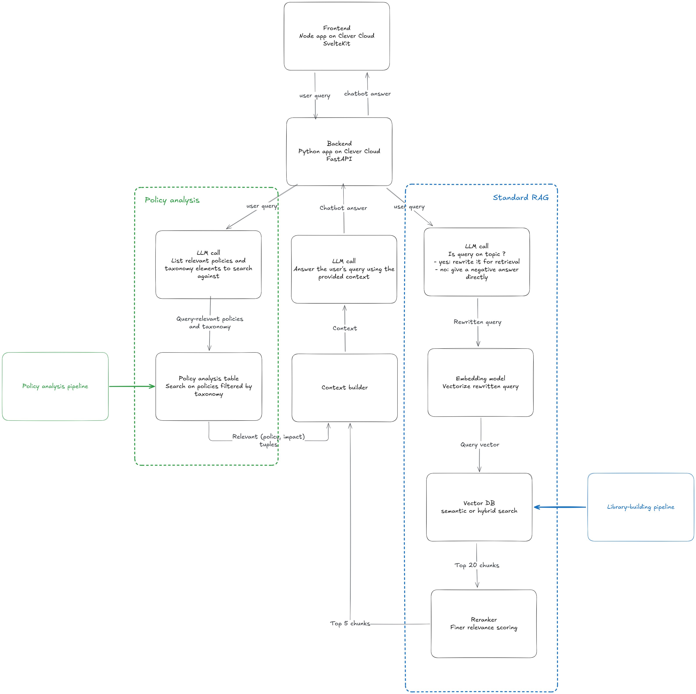

# Chat Sufficiency

Folder org:
```
- old: previous work based on Kotaemon
- backend: python backend using FastAPI and implementing RAG
- frontend: typescript frontend using SvelteKit
```

## Quick start (dev setup)
```
# start backend
cd backend
cp .env.example .env
# fill in correct values in .env
uv run uvicorn app.main:app --reload

# start frontend (dev)
cd frontend
cp .env.example .env
npm install
npm run dev
```

## Pipeline  and architecture
Here is the pipeline and main architectural elements:
1. The **SvelteKit frontend** sends a query to the **FastAPI backend** via a POST request.
2. The backend calls a **generative AI API (Scaleway)** to determine whether the query is on-topic. If yes, it rewrites it for retrieval. If not, it answers directly.
3. The rewritten query is embedded on the server's CPU with a small model using **sentence-transformers**. It would be more cost-efficient to use an API and a smaller instance, but the embedding model we started with, **Qwen3-embedding-0.6B** isn't available on any commercial API.
4. The server sends the query to **Qdrant** (vector db), that returns the top $k_{vector}$ matches (configurable).
5. It then reranks the results locally using **flashrank**. Again, a more mature version might use e.g. Cohere's API.
6. The top $k_{rerank}$ chunks are then used to build the context. If the FETCH_PUBS env var is true (default), we use the OpenAlex ID of the chunks to fetch the corresponding publications from **OpenAlex's API**. We build the context using the title, abstract, and the retrieved chunks. 
7. The context is passed along with the original query to the generative API and the backend streams back the response the the frontend.
8. The backend saves the messages and intermediary results to **Postgres**.

SvelteKit is a full-stack framework for Svelte, similar to Next for React or Nuxt for Vue. We could almost have used it as a static site generator, but we use server-side functions to hide the backend's URL from the user.

The schema below is an illustration of the aformentioned pipeline. Note that the policy analysis retrieval isn't implemented yet.



## CleverCloud deployment
Both applications (front and back) are deployed to CleverCloud on the World Sufficiency Lab organization. CC handles the continuous deployment at each push to the given branch.

The frontend requires a larger instance to build than to run, so we configured one. CC also doesn't include build step by default, so it needs to be configured via env vars.

Due to the local computations, the backend currently demands 4 GB of RAM. CleverCloud also doesn't handle uv well, so we need to go through pip. Use :
```
uv pip compile pyproject.toml --output-file requirements.txt
```
to create `requirements.txt` file from `pyproject.toml`. To avoid installing useless GPU-related libraries, pyproject.toml is configured to install torch+cpu. For this to work, don't forget to add this line at the start of `requirements.txt` after generating it :
```
--extra-index-url https://download.pytorch.org/whl/cpu 
```


## TODO
- suggestions (of questions)
- prompt: answer in same language as query
- prompt: don't forget social floor
- hybrid search
- policy analysis
- optimize cost (use APIs for query embedding and reranking to use a smaller server instance)
