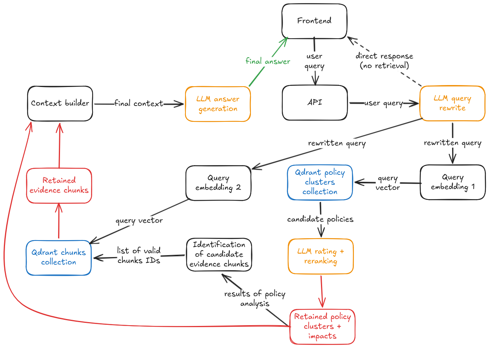

# Chat Sufficiency

Folder org:
```
- old: previous work based on Kotaemon
- backend: python backend using FastAPI and implementing RAG
- frontend: typescript frontend using SvelteKit
```

## Quick start (dev setup)
```
# start backend
cd backend
cp .env.example .env
# fill in correct values in .env
uv run uvicorn app.main:app --reload

# start frontend (dev)
cd frontend
npm install
cp .env.example .env
npm run dev
```

## Pipeline  and architecture
Here is the pipeline and main architectural elements:
1. The **SvelteKit frontend** sends a query to the **FastAPI backend** via a POST request.
2. The backend calls a **generative AI API (Scaleway)** to determine whether the query is on-topic. If yes, it rewrites it for retrieval. If not, it answers directly.
3. The rewritten query is embedded with **Qwen3-embedding-8B** from Scaleway's Generative API for policy retrieval.
4. The server sends the query to **Qdrant** (vector db), that returns the top $k_{vector}$ matches (configurable). Our Qdrant cluster has two interesting collections: `library-v1` (containing chunks) and `clusters-v260319` (containing policy clusters with the impact analysis from the policy analysis pipeline). It returns the $k_{vector}$ closest policy clusters.
5. We ask a LLM to rate the returned policies on a scale of 0-9 (single-digits ensure the LLM can output a single token) in terms of relevance to the user query. The reranking LLM has access to the impact analysis from policy analysis for this task. We keep only those above a certain threshold and use the rating for reranking, keeping at most $k_{rerank}$. We also ask the reranking LLM to select a number of impact dimensions relevant to the user query.
6. For each returned policy and each identified relevant impact dimension, we have access thanks to policy analysis to a list (potentially empty) of chunks that demonstrate each impact direction (positive, negative, neutral). For each, we select at most two chunks to include as example in the context. A lot of these chunks will be completely irrelevant to the user query, so we add a second step of vector similarity search: we embed the query, this time on the server's CPU with **Qwen3-embedding-0.6B** and query the `library-v1`, filtering the chunk IDs to be included in the aforementionned list.
6. The retained policies and example chunks are then used to build the final context. If the FETCH_PUBS env var is true (default), we use the OpenAlex ID of the chunks to fetch the corresponding publications from **OpenAlex's API** and add their title and abstract to the context.
7. The context is passed along with the original query to the generative API and the backend streams back the response the the frontend.
8. The backend saves the messages and intermediary results to **Postgres**.

SvelteKit is a full-stack framework for Svelte, similar to Next for React or Nuxt for Vue. We could almost have used it as a static site generator, but we use server-side functions to hide the backend's URL from the user.

The schema below is an illustration of the aformentioned pipeline. Note that the policy analysis retrieval isn't implemented yet.



## CleverCloud deployment
Both applications (front and back) are deployed to CleverCloud on the World Sufficiency Lab organization. CC handles the continuous deployment at each push to the given branch.

The frontend requires a larger instance to build than to run, so we configured one. CC also doesn't include build step by default, so it needs to be configured via env vars.

Due to the local computations, the backend currently demands 4 GB of RAM. CleverCloud also doesn't handle uv well, so we need to go through pip. Use :
```
uv pip compile pyproject.toml --output-file requirements.txt
```
to create `requirements.txt` file from `pyproject.toml`. To avoid installing useless GPU-related libraries, pyproject.toml is configured to install torch+cpu. For this to work, don't forget to add this line at the start of `requirements.txt` after generating it :
```
--extra-index-url https://download.pytorch.org/whl/cpu 
```
